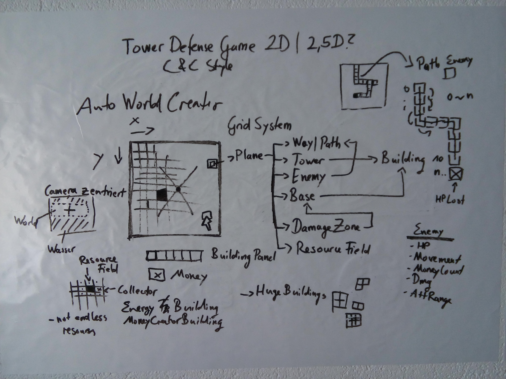
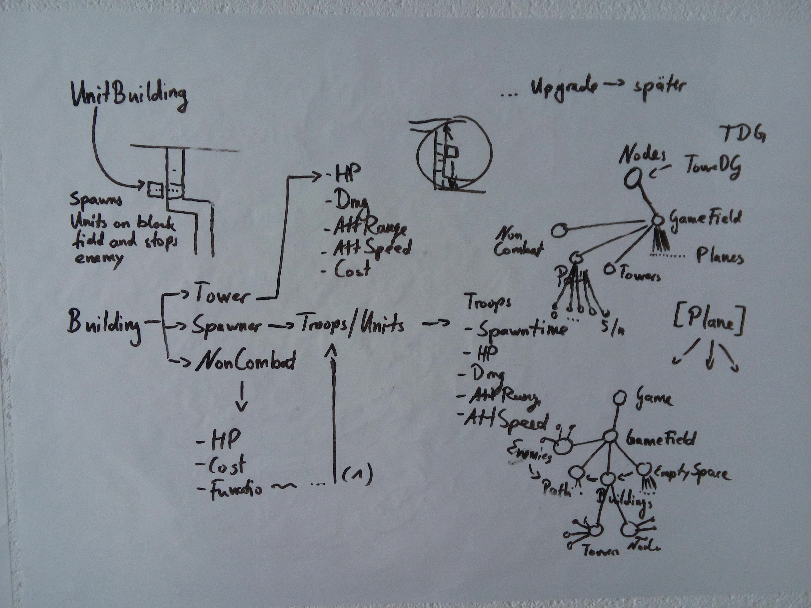

# Gamedesigndocument
## TowerDefenseGame

Beim TowerDefenseGame handelt es sich, wie der Name schon sagt, um ein simples "Turmverteidigungsspiel".
Es ist ein 2,5D Strategiespiel, was bedeutet, dass 2D und 3D Elemente eingebaut wurden.
Im Spiel muss der Nutzer solange durchhalten und seine Basis verteidigen wie möglich. Er kann daher nicht wirklich gewinnen.
Sinn hinter dieser Idee ist den Nutzer dazu zu motivieren einen Highscore zu erzielen und diesen zu knacken.

## Features
* unterschiedliche Gebäude
* Türme mit verschiedenen Effekten
* Resourcen können gesammelt und generiert werden
* Spieler kann nicht gewinnen und muss solange durchhalten wie er kann
* Zufällige Maps
* Forschung kann betrieben werden und schaltet neue Gebäude und Türme frei

## Konzeptentwurf

Die ersten Entwürfe wurden mit einem Whiteboard erstellt und weiterentwickelt.

Spiel orientierte sich an den alten C&C Spielen wie Command & Conquer: Alarmstufe Rot.
Einige Ideen im Kozeptentwurf wurden nicht realisiert wie z.B. die Möglichkeit zu geben, dass Feinde Türme und Gebäude angreifen konnten.